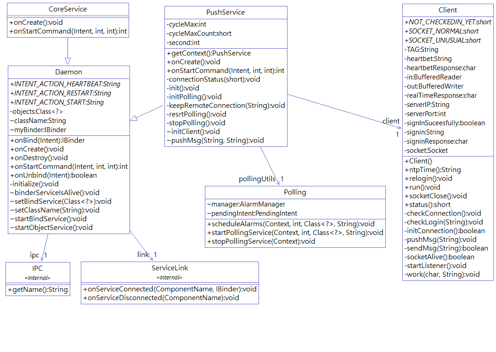
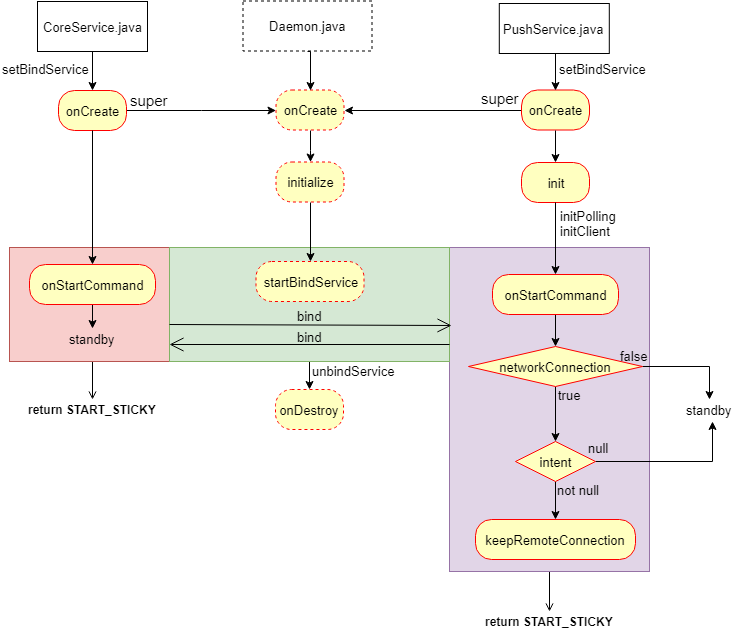

# **Android後臺服務常駐守護機制**
>* ##### 基於在Strategy App專案設計需求上,需要全天候接收Server端發送的訊息,所以必須在使用者離開APP時能具備和Server持續保持連線並不定時接收訊息後,將訊息推送至系統介面顯示給使用者看的功能,這個服務特性在於實現了兩個服務綁在其中一方服務被終止時,存活的一方可以重新啟動被終止的服務。

##### 圖 1. 後臺常駐服務類別關係圖:

* ##### **圖 1.** 說明Strategy後臺服務基於Daemon類別為基礎,由CoreService,PushService繼承Daemon服務,並從PushServic延伸Client遠端服務通訊與Polling系統輪詢功能。

##### **圖 2.** 後臺常駐服務主流程圖:

* ##### **圖 2.** 說明後台啟動後主要流程,當CoreService與PushService第一次被啟動後先設定綁定對象,之後執行onCreate與父類onCreate,在父類initialize裡執行服務綁定動作。
* ##### CoreService在這裡很單純的啟動後就進入待機,不被系統倫詢。
* ##### PushService在init設定系統輪詢與client連線服務,之後onStartCommand檢查網路狀態,如果無網路服務則待機等待下一次輪詢,如果網路正常intent不等於null則執行遠端保持連線動作,如果intent等於null則待機等待下一次輪詢,之後每次系統輪詢,PushService就被喚醒重複一次紫色區塊裡的流程,確保後台遠端服務連線正常。

* ##### 當服務在onStartCommand流程中如果終止則依上一次返回值START_STICKY,將被系統自動重新啟動,啟動後的調用intent值為null,如果服務在onDestroy後終止,則由綁定對像重新啟動該服務。

##### 除了上述中由系統和綁定對象重新啟動服務外,可以在app啟動或系統廣播動作中,檢查服務是否存在,不存在就重新啟動服務。

* #####  **總結** : 後臺服務可以藉由3個部分決定是否被重新啟動執行
        1. START_STICKY 
        2. app啟動後檢查
        3. 系統廣播動作
              使用者觸發以下動作:
                  裝置重新開機
                  連接電源
                  斷開電源
                  使用者解鎖螢幕
                  網路連線變化

        PS:最後不要忘記設定自動啟動管理為開啟,或是引導使用者開啟此功能

 ##### 你可以在 **daemon.code.v1.0** package裡找到實現上述程序的代碼,這個版本裡代碼有部分需要你修改成符合你專案上的需求,因為有些部分是我自己的專案上的需求,這些部分代碼會在下一個版本中優化使他成為一個獨立的小系統,代碼中註釋掉的部分是在下專案開發需要的方法,在你的專案中可能不會需要他,所以幫你註釋掉了,註釋的代碼有:

 * ***PushService.java***

   * ##### void pushMsg(String title, String text) 你可能不會需要他

 * ***Client.java***

   * ##### String ntpTime() 你可能不會需要他
   * ##### work(char action,String text) 這裡你可能會想要實現自己的做法
   * ##### void checkLogin(String text) 你可能不會需要他
   * ##### void checkConnection() 你可能不會需要他
   * ##### void pushMsg(String text) 你可能不會需要他

* ***daemon.code.v1.0 package 各類別功能如下:***
  * ##### Daemon.java 服務守護父類,實現了服務綁定,服務離線重啟 
  * ##### PushService.java 推送服務,實現了訊息推送,遠端通訊
  * ##### CoreService.java 核心服務,作為綁定對象
  * ##### polling.java 系統輪詢
  * ##### Client.java 通訊
  * ##### IO.java 檔案讀寫
  * ##### Device.java 裡面有網路狀態相關,檢查服務是否運行方法
  * ##### SystemBroadcastReceiver.java 系統廣播接收
  * ##### NotificationUI.java 訊息通知 X
  * ##### User.java 使用者訊息加解密存取 X
  * ##### AES.java 訊息加密 X
  * ##### ServiceManager.java 服務啟動相關功能 X
 
#### 後面打 X 表示你可能不會需要的部分,剩下部分足以實現後台長駐服務,遠端通訊,與系統輪詢功能
##### 你可能會需要在AndroidManifest.xm中做以下設定:

    <uses-permission android:name="android.permission.INTERNET" />
    <uses-permission android:name="android.permission.ACCESS_NETWORK_STATE" />
    <uses-permission android:name="android.permission.READ_PHONE_STATE"/>
    <uses-permission android:name="android.permission.ACCESS_WIFI_STATE"/>
    <uses-permission android:name="android.permission.RECEIVE_BOOT_COMPLETED" />

    <!-- 核心服務  -->
    <service android:name="com.attraxus.service.CoreService"  	 
             android:exported="false" 
             android:priority="1000">
    </service>
    <!-- 推送服務  -->
    <service android:name="com.attraxus.service.PushService"           	
             android:exported="false" 
             android:priority="1000">
        </service>
    <!-- 系統廣播  -->
    <receiver android:name="com.attraxus.service.SystemBroadcastReceiver"
              android:exported="true">
		<intent-filter>
		    <action android:name="android.intent.action.USER_PRESENT" />
		    <action android:name="android.intent.action.ACTION_POWER_CONNECTED"/>
		    <action android:name="android.intent.action.ACTION_POWER_DISCONNECTED"/>
		    <action android:name="android.intent.action.BOOT_COMPLETED"/>
		    <action android:name="android.net.conn.CONNECTIVITY_CHANGE" />
    	</intent-filter>
	</receiver>

##### 以上在 
        小米4 Android6.0
        Asua Zenfone Android4.4.2

##### 測試在失去後臺服務後可以被重新啟動,在網路狀態改變時能夠重新連接遠端服務,並在每一分鐘確認一次遠端連線,達到省電與連線維持確認雙贏,也在無網路連線狀態及intent動作不明情況中服務將處於待機,等待下一次系統輪詢,使後臺服務不浪費裝置珍貴cpu資源

##### 有任何問題歡迎交流 : **<hsu-chia-chang@hotmail.com>**
